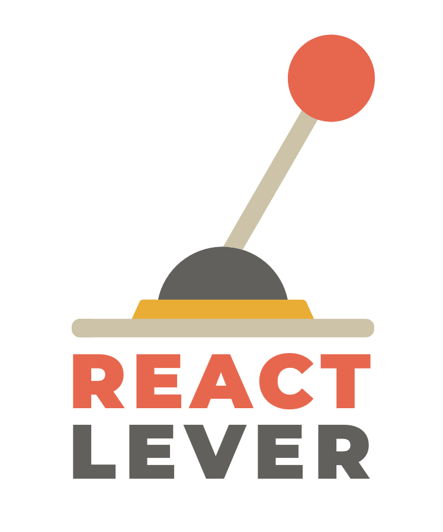

# React Lever

> Minimalistic feature toggling for React

<p align="center"></img></p>

## Table of Contents

- [React Lever](#react-lever)
  - [Table of Contents](#table-of-contents)
  - [Installation](#installation)
  - [Usage](#usage)
  - [`<LeverProvider>` props](#leverprovider-props)
    - [isDev](#isdev)
    - [features](#features)
  - [`<Lever>` props](#lever-props)
    - [feature](#feature)
    - [enabled](#enabled)
    - [devOnly](#devonly)
  - [License](#license)

## Installation

```
npm install react-lever --save
```

or install with [Yarn](https://yarnpkg.com) if you prefer:

```
yarn add react-lever
```

## Usage

Wrap your application in a `<LeverProvider>`, and your features in a `<Lever>` like so:

```jsx
import React, { Component, Fragment } from 'react';
import ReactDOM from 'react-dom';
import Lever, { LeverProvider } from 'react-lever';

const AnimalPhotos = () => (
  <Fragment>
    <h1>Photos of animals</h1>

    {/* This will render as enabled=true */}
    <Lever feature="dogs">
      <DogPhotos />
    </Lever>

    {/* This will not render as enabled=false */}
    <Lever feature="cats">
      <CatPhotos />
    </Lever>

    {/* This will render as enabled=true, but will only render if in a development environment as devOnly=true. */}
    <Lever feature="parrots">
      <ParrotPhotos />
    </Lever>
  </Fragment>
)

const features = {
  dogs: { enabled: true },
  cats: { enabled: false },
  parrots: { enabled: true, devOnly: true }
};

ReactDOM.render(
  <LeverProvider isDev={process.env.APP_ENV === 'development'} features={features}>
    <AnimalPhotos />
  </LeverProvider>,
  document.querySelector('#root')
);

```

## `<LeverProvider>` props

### isDev

> `boolean` | Optional

Is the app in a development environment?

If `false`, and a feature is flagged with `enabled` and `devOnly` attributes as `true`, then the feature will not render.

### features

> `{ [feature]: { enabled: boolean, devOnly: boolean } }` | Required

The global features of the application.

## `<Lever>` props

### feature

> `string` | Required

The key (or name) of the feature.

### enabled

> `boolean` | Optional

If `true`, then the feature will render. This prop overrides the `enabled` flag in the `<LeverProvider>`'s features.

### devOnly

> `boolean` | Optional

If `true`, then the feature is available to the development environment only (as specified in `<LeverProvider>`'s `isDev` prop). This prop overrides the `devOnly` flag in the `<LeverProvider>`'s features.

## License

MIT © [Medipass Solutions Pty. Ltd.](https://github.com/medipass)

